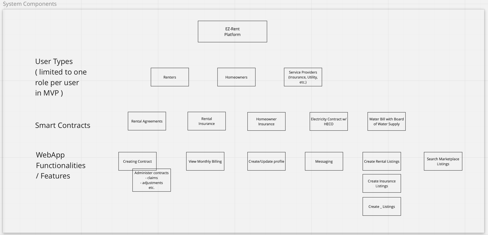
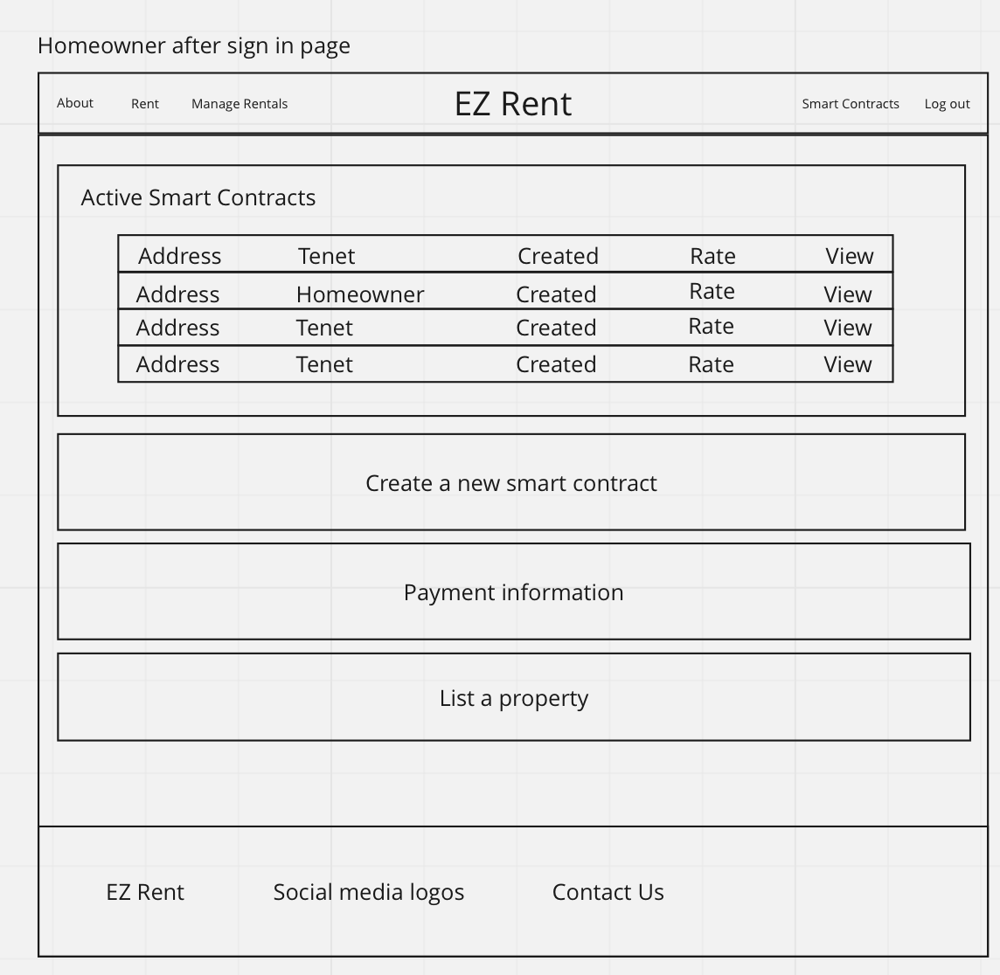

[Back to Home](./index.md)

<h1 id='concept'>Concept</h1>

This page describes our teams concept work prior to implementation. 

### System Components and Features

### Brainstorming Mockups

<h4>Homeowner examples</h4>

<h5>Landing page</h5>

<h5>Homeowner homepage</h5>

<h5>Homeowner Property Overview</h5>

<h5>Homeowner Contract editor</h5>

<h4>Renter examples</h4>

<h5>Potential listings</h5>

<h5>Negotiator component</h5>

### Use Cases

- Smart Contracts
    - Participants
    - payment period
    - payment frequency
    - contract time length
- Users login to view
    - smart contract status
    - smart contract summary
    - expenses from rentel per month
    - income from rentals per month
- Homeowner smart contract creation

### Application Component definition, used as a guide to create application creation

### Smart Contract Implementation

### Beyond the Basics

- Smart contracts are immutable programs that can be used by the Ethereum blockchain. They cannot be changed once they are deployed therefore it is a sound commitment by both parties.
- Solidity: Language that smart contracts will be written in
    - Solc: Solidity compiler, used to compile smart contracts to return the ABI and Bytecode of a smart contract
        - ABI: Application Binary Interface
            - An array of function definitions to be used by our application
        - Bytecode:
            - Bytecode that is read by the Ethereum Virtual Machine, this project does not go further in depth of the EVM
- Ethersjs
    - Javascript library that's developed to use smart contracts. It's easy for beginners, and allows for simple contracts to be created and deployed
- Python compiler server
    - Meteor is unable to utilize Solc internally, so all smart contracts will be compiled by a python script on a server external to the app
- Ethereum network
    - Using the Ganache application by HardHat as a test network
        - Simulated the Ethereum blockchain
        - Keep track of transactions easily
        - Has a GUI for ease of use
    - May possibly create an assortment of dummy accounts with metamask and utilize Ethereum test networks that are available. 
