<style type="text/css">
   th, td { text-align: right; }
</style>

# AkaMy-Rent 

### Sitemap 

- [Homepage (this page)](./index.md)
  - [Project Links](#project-links)
  - [Project Overview](#project-overview)
  - [Community Feedback](#feedback)
  - [User Guide](#user-guide)
  - [Developer Guide](#dev-guide)
- [Project Team](./team.md)
- [Concept Development](./concept-phase.md)
- [Milestone 1](./ms1.md)
- [Milestone 2](./ms2.md)
- [Milestone 3](./ms3.md)


<h2 id='project-links'>AkaMy-Rent project links</h2>

- [AkaMy-Rent organization page repository](https://github.com/akamy-rent/akamy-rent.github.io)
- [AkaMy-Rent project repository](https://github.com/akamy-rent/akamy-rent)
- [www.akamy-rent.space Deployment](https://www.akamy-rent.space)
- Project boards:
  - [#1](https://github.com/akamy-rent/akamy-rent/projects/1)
  - [#2](https://github.com/akamy-rent/akamy-rent/projects/2)
  - [#3](https://github.com/akamy-rent/akamy-rent/projects/3)

<h2 id='project-overview'> Overview </h2>

Finding housing during University can be stressful for students. Homeowners are cautious when dealing with students as the rental agreements tend to be shorter, and having to consistently find a tenant can also be stressful. AkaMy-Rent hopes to provide a framework that allows rental agreements to be: more accessible, easier to make, and provide a greater level of assurance for both homeowners and renters. Renters can benefit by having an assured rental cost that won't go up so long as their contract is secured on the blockchain. Homeowners can benefit by using the automated features of a smart contract and the Ethereum blockchain to ensure that rent comes in on time and can be fully paid.


<h2 id='user-guide'>User Guide</h2>

The following documents the currant progress and status of the AkaMy-Rent application. 

#### Landing Page
The landing page of the app shows the main benefits of using smart contracts. The user can sign up a new account or login in a existed accouunt. After logging in the account, the navigation bar in the landing page will show three options: Dashboard, Add Smart Contract, and Messenger which provide users with a quick start of the website main fucntions.

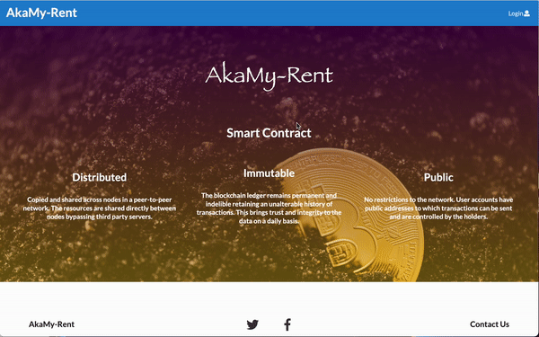

#### Profile Page

Once Users create a new account, they are directly prompted to the edit profile page filled with default placeholder values. Whenever users are on different window and wanted to view their profile, they can go to the top right corner and click on the dropdown menu to select view profile. Then, they can make the necessary changes to the form fields and can confirm the changes have been submitted successfully by the alert.

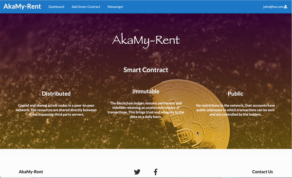

#### Dashboard

After signing in, the user can view their dashboard by clicking the button in the navigation bar. The dashboard provides an overview of all current contracts and some KPIs. At the top of the dashboard, the users can check their total active contracts, income and expenses. In the Smart Contracts field, there is a table for users to view all of their contracts, which contains the information of house address, homeowner name, tenant name, status and so on. The user can choose to sign, edit, view and check the transactions for each contract.

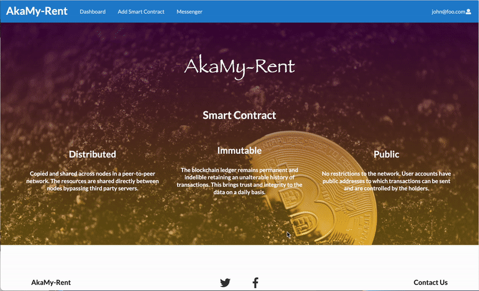

Last but not least, there are three buttons: create contracts, messenger and my profile which will redirect users to the exact pages.

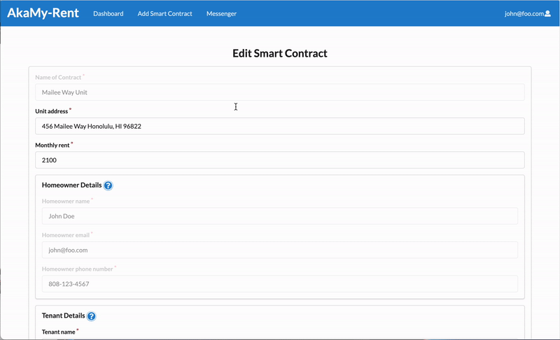

#### Smart Contracts
Any user can create a smart contract and those who do so will be assumed to be the homeowner. To do so, click on the 'Create Smart Contract' tab in the navbar.

The user will be taken to the 'Create Smart Contract page', which contains a form and fields for the user to complete. User will notice that the **Homeowner Details** field has been filled and cannot be changed anymore. This helps the homeowner create a smart contract in a fast and accurate way. When all fields are completed, pressing the 'save' button will save the data and create a new smart contract. The homeowner will find the new contract in the dashboard table which in a **Pending** status.

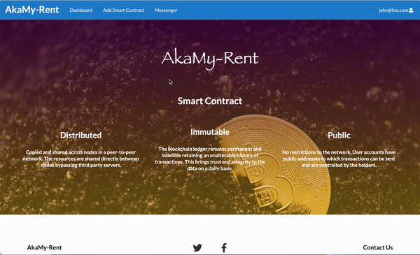

To modify the smart contract draft, the homeowner can select the 'Edit' page and make the necessary revisions. When completed, the homeowner can save their new updates for the tenant to view again. After confirming the contract information in correct, homeowner can click the 'Sign' button to sign the smart contract. They will have to enter full name to sign. After signing the contract, their name will be displayed in the **Homeowner Signature** filed.

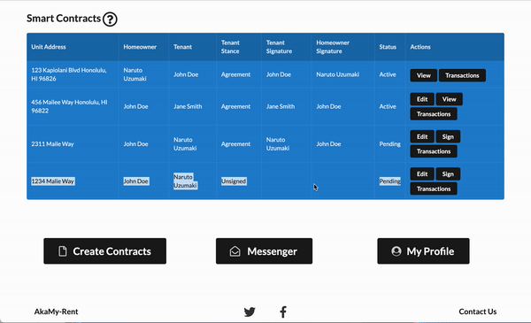

The tenant will be able to view this smart contract from their account dashboard if their user correct account email is inputted into the 'Tenant email' field. The tenant can view the smart contract draft and declare their stance on the proposed smart contract by selecting 'Agreement' or 'Unsigned'. After selecting their stance and pressing save, the homeowner will be able to see the tenant stance. If the tenant agrees, they can go on to fill out the signature field. Once taking a signature, this field disappears. If the tenant disagrees with the proposed smart contract, they can reach out to the homeowner about their concerns through the 'Messenger' feature. Only the tenant can fill out these fields.

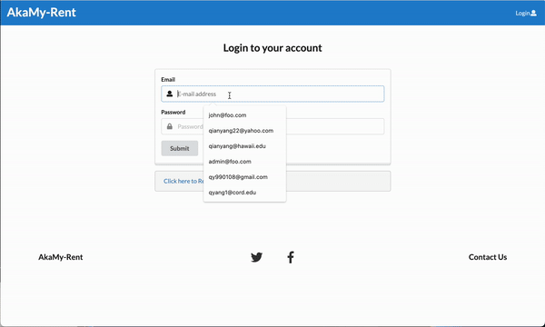


Smart Contracts are deployed once the system recognizes that:
1. That the tenant has agreed to the terms and conditions
2. The homeowner and tenant have both signed

This changes the status of the contract to `Active` meaning that the contract is now deployed. The `Pending` status indicates that there are missing signatures for the current agreement. 

## picture of non-deployed  contract

As of now there is no way to connect the deployed version of the application to an actual blockchain nor a test blockchain. If you wish to use a test blockchain with Ganache or another private network you can skip to [Blockchain development guide](#blockchain-dev-guide). 


#### Messenger
The messenger component allows users on the same contract to communicate with one another. Every time a contract gets created, a group is created with the members of the smart contract. The contract name is then used as the messenger group name. The screenshots in the gif below show the automatic screen updates during a conversation between two users.

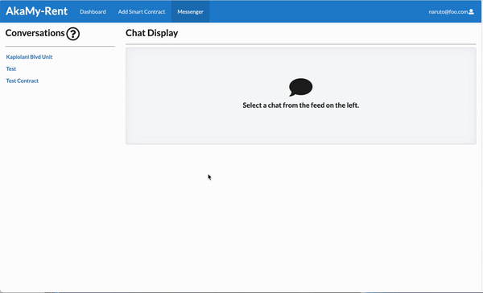


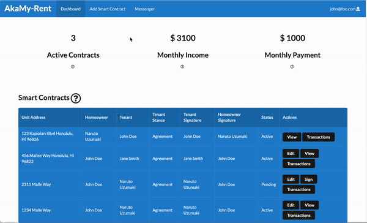


<h2 id='feedback'>Community Feedback</h2>

### "Ethereum? What's an Ethereum?"
The bottom line is that Ethereum just isn't that popular right now. When told about the "above and beyond" portion of our project most people didn't care that it was Ethereum. Community members focused on how easy it was to create rental agreements and that the site was very straight forward. But for one community member who was familiar with the technology, the concept of who pays the **gas fee** for each transaction came up.  

### "So what happens now?"
In our initial testing many users found the landing page didn't guide them into using the application. We decided that adding a few buttons to the landing page would be helpful. Users also thought it would be helpful to have the `create profile` and `edit profile` pages lead back to different pages. At this moment we haven't figured out the redirect for the `edit profile` to the `view profile` page. But after sign up users are prompted to the dashboard where they can view their profiles. Overall they found navigation of the site to be pretty obvious and contract creation to be straight forward.


### Homeowner focused
Although we had set out to create an app that was for **students** we quickly found out that this application was definitely homeowner focused. Users got excited seeing their **Income** value go up, but (as expected) they weren't as excited when about their **Payment** value on the dashboard. Some community members mentioned that this application heavily relies on homeowners being able to enter the correct information and understanding how to use the platform, which can be worrisome when homeowners have that much power.

### Insights on the future

Community members discovered that this could not only be used for residential properties, but it could also be used as way to manger commercial properties as well.

Community members wanted the ability to create flexible lease dates, and a way to negotiate apart from the messenger application. For example, one community member suggested the use of a "rejection and explanation text field" on the signature page.

Community members wanted the messenger to alert them when they have messengers, but overall they were happy with the ability to directly message their landlords and  landlords found it useful message their tenants. They also wanted the messenger to have a calendar system so that way the homeowner can schedule various things on appointments with it. With the emphasis on homeowners we could have this as a property management application as well(which it already has).

Our initial brainstorming idea had ways to cater to subletting, multiple tenants with different pay periods, as well as having the system use profile information to create the smart contract rather than entering it manually. But that functionality was beyond our timeline.

There are also smart contract security concerns, but that is beyond the scope of this project.

<h2 id='dev-guide'>Developer Guide</h2>

<h3 id='meteor-dev-guide'>Meteor Guide</h3>

First, [install Meteor](https://www.meteor.com/install).

Second, request access from the author and clone the [akamy-repo](https://github.com/akamy-rent/akamy-rent).

Third, install libraries from within the `/app` directory

```
$ meteor npm install
```

And start the app

```
$ meteor npm run start
```

Should there be no problem, the app will run on localhost with port 3004 (http://localhost:3004), or whichever port you specify in the [package.json start script command](https://github.com/akamy-rent/akamy-rent/blob/c506b1976d906f0c54c8aa907a37aa876906755f/app/package.json#L42).


<h3 id='blockchain-dev-guide'>Smart Contract Development</h3>

This portion explains how to AkaMy interacts with the Python compilation server and the Ganache simulated blockchain. This assumes that the reader has access to their own server to run the Python compilation server. In the following text, `PYTHON_SERVER_IP` and `PYTHON_SERVER_USER` are used to represent the IP address and user of said server. 
- Developers can change the code of the python server in `/app/py-compile-server/test_server.py`

<h4 id='initialize'>Initialize the app</h4>
Start the app with the port number reserved for the Ganache test network `GANACHE_URL=http://localhost:PORTNUMBER meteor npm start`
- Here's an example with the port being reserved for 8545 `GANACHE_URL=http://localhost:8545 meteor npm start`
  
#### Initialize chrome

## Warning: Only use the insecure version of Chrome to run the AkaMy-Rent app. Using the insecure version of Chrome on other websites may lead to security breaches.
`open -n -a /Applications/Google\ Chrome.app/Contents/MacOS/Google\ Chrome --args --user-data-dir="/tmp/chrome_dev_test" --disable-web-security`

For blockchain interaction and use of the python compile server, developers must use an insecure chrome instance.
We currently do not have a workaround for the bug below other than opening an insecure Chrome instance, this is due to the fact that Google Chrome doesn't allow APIs to interact with other websites or addresses.


#### Stage 1 complete: Application started


#### Initialize the Python Server
- In another terminal window run : `ssh PYTHON_SERVER_USER@PYTHON_SERVER_IP` .
- Use your password to login.
- Run the python server script `python3 /home/akamy-rent/py-compile-server/test_server.py`.
- You should then see `Server started http://PYTHON_SERVER_IP:9000` signaling that your server is ready to receive input.

#### Example of the server running

```
Hokus-MacBook-Pro:app hoku$ PYTHON_SERVER_USER@PYTHON_SERVER_IP
PYTHON_SERVER_USER@PYTHON_SERVER_IP's password: 
Welcome to Ubuntu 20.04.4 LTS (GNU/Linux 5.4.0-97-generic x86_64)

 * Documentation:  https://help.ubuntu.com
 * Management:     https://landscape.canonical.com
 * Support:        https://ubuntu.com/advantage

  System information as of Tue Apr 26 00:51:38 UTC 2022

  System load:  1.04               Users logged in:       0
  Usage of /:   12.2% of 24.06GB   IPv4 address for eth0: PYTHON_SERVER_IP
  Memory usage: 27%                IPv4 address for eth0: 10.18.0.7
  Swap usage:   0%                 IPv4 address for eth1: 10.110.0.4
  Processes:    109

0 updates can be applied immediately.


*** System restart required ***
Last login: Tue Apr 26 00:42:41 2022 from 76.173.228.38
root@python-server:~# python3 /home/akamy-rent/py-compile-server/test_server.py 
Server started http://PYTHON_SERVER_IP:9000
```

#### Stage 2 complete: Compile server started 


### In order to use Ganache you must have enabled the correct port in [the initialization of the app](#initialize)
#### Initialize Ganache and gather account information for testing
- Open up Ganache and select the `Quickstart` option


- There will be a menu filled with 10 accounts that are usable. Near the top there's a series of labels, make sure `RPC SERVER` is set to `HTTP://127.0.0.1:8545`.
  - If it's not set to that select the `gear icon near the top right corner` to change it.
  - Select `Server` in the navigation bar and make from there you can set it to the appropriate IP and port.


- Once your Ganache server IP and port have been set. Click the key icon to manually copy and paste `ACCOUNT ADDRESS` and `PRIVATE KEY` to wherever key data is stored.


- Developers have the option to alter default user data in `/app/settings.development.json` or they can add an account with `ACCOUNT ADDRESS` in the `Wallet address `field and the `Private Key` field.

#### Stage 3: Key information copied to application


#### Utilizing the new functionality of deploying smart contracts
Now all systems are set up and accounts are initialized the test server. You may now try the sign to deploy feature that's built into the smart contract signing process. Once the tenant has agreed to the terms and conditions along with both participants signing the contract you can deploy the smart contract to the test network

#### Stage 4 completed: Test page can be used


#### Smart contract deployment pictures

#### Agreement is signed by both participants and the tenant agrees to the terms of the agreement.
#### There's no message indicating we are not on a blockchain.
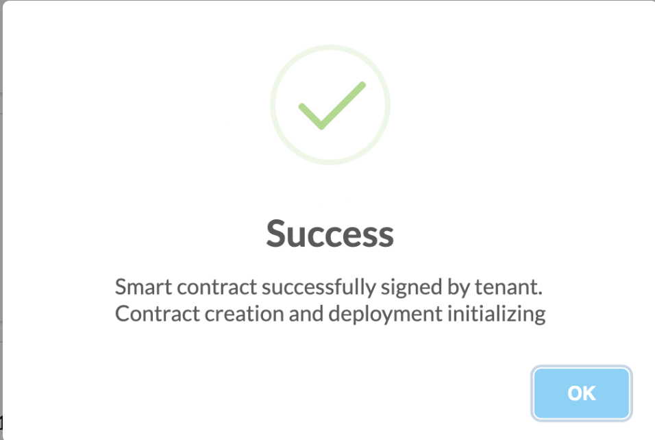
#### The contract information is sent to the compiler server, which returns the abi and bytecode.

```
root@python-server:/home/akamy-rent/py-compile-server# python3 test_server.py 
Server started http://206.189.2.161:9000
76.173.228.38 - - [09/May/2022 07:41:27] "POST / HTTP/1.1" 200 -
// SPDX-License-Identifier: MIT
pragma solidity >0.8.4;
contract Agreement{

    address private homeowner = 0x7F91BD1e787121ADf7b75A7FF4eE0944Fa021B16;

    function payRent(address payable _hOwner) external payable{
        _hOwner.transfer(msg.value);
    }

    function close() external {
        selfdestruct(payable(homeowner));
    }
    

    fallback() external payable{}
}
```

#### The contract can now be deployed to the blockchain. The homeowner must give an insignificant amount of Ether to initially fund the functionality of contract(not shown)
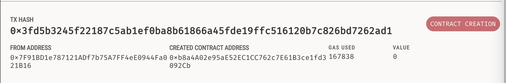

#### All contracts as of now can be called every second from deployment. Contracts are called 5 times before detonation.
##### There is code to use longer time periods, but it's impossible to test those without some kind of software based time manipulation.
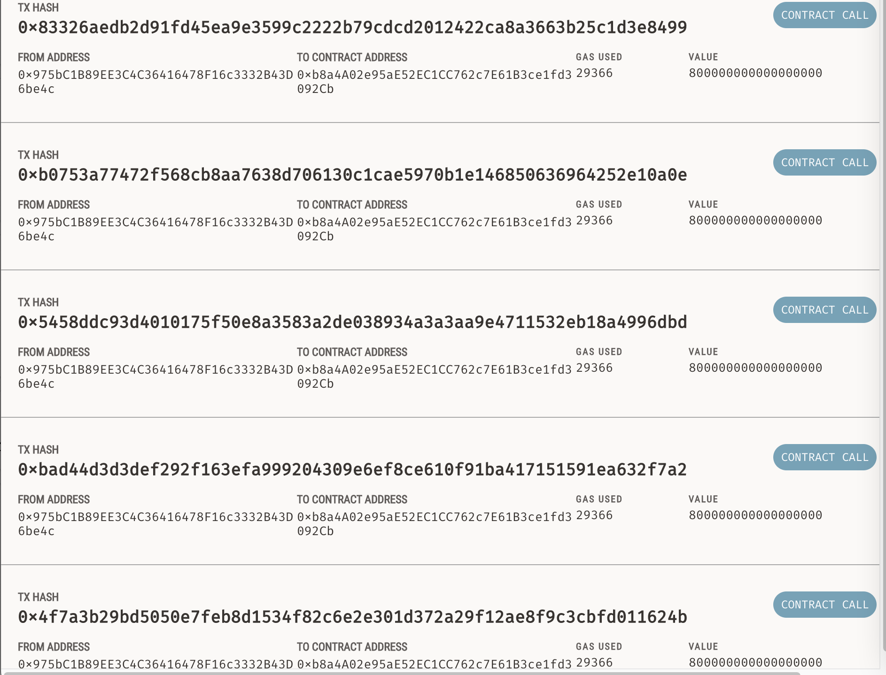

#### Contracts are destroyed which pays the owner. Contract destruction payments encourages Ethereum users to free-up resources of the network.
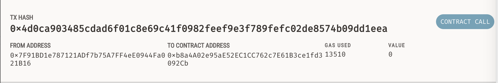


