<style type="text/css">
   th, td { text-align: right; }
</style>

# AkaMy-Rent 

### Sitemap 

- [Homepage (this page)](./index.md)
  - [Project Links](#project-links)
  - [Project Overview](#project-overview)
  - [User Guide](#user-guide)
  - [Developer Guide](#dev-guide)
- [Project Team](./team.md)
- [Concept Development](./concept-phase.md)
- [Milestone 1](./ms1.md)
- [Milestone 2](./ms2.md)
- [Milestone 3](./ms3.md)


<h2 id='project-links'>AkaMy-Rent project links</h2>

- [AkaMy-Rent organization page repository](https://github.com/akamy-rent/akamy-rent.github.io)
- [AkaMy-Rent project repository](https://github.com/akamy-rent/akamy-rent)
- [www.akamy-rent.space Deployment](https://www.akamy-rent.space)
- Project boards:
  - [#1](https://github.com/akamy-rent/akamy-rent/projects/1)
  - [#2](https://github.com/akamy-rent/akamy-rent/projects/2)
  - [#3](https://github.com/akamy-rent/akamy-rent/projects/3)

<h2 id='project-overview'> Overview </h2>

Finding housing during University can be stressful for students. Homeowners are cautious when dealing with students as the rental agreements tend to be shorter, and having to consistently find a tenant can also be stressful. AkaMy-Rent hopes to provide a framework that allows rental agreements to be: more accessible, easier to make, and provide a greater level of assurance for both homeowners and renters. Renters can benefit by having an assured rental cost that won't go up so long as their contract is secured on the blockchain. Homeowners can benefit by using the automated features of a smart contract and the Ethereum blockchain to ensure that rent comes in on time and can be fully paid.


<h2 id='user-guide'>User Guide</h2>

The following documents the currant progress and status of the AkaMy-Rent application. 

#### Landing Page
The landing page of the app shows the main benefits of using smart contracts.


#### Profile Page

Once Users create a new account, they are directly prompted to the edit profile page filled with default placeholder values.

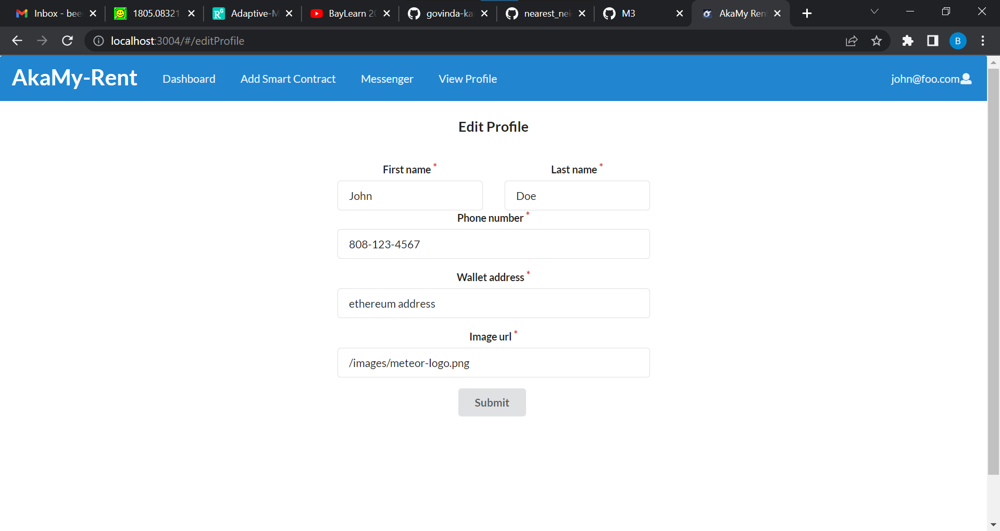

Then, they can make the necessary changes to the form fields and can confirm the changes have been submitted successfully by the following alert.

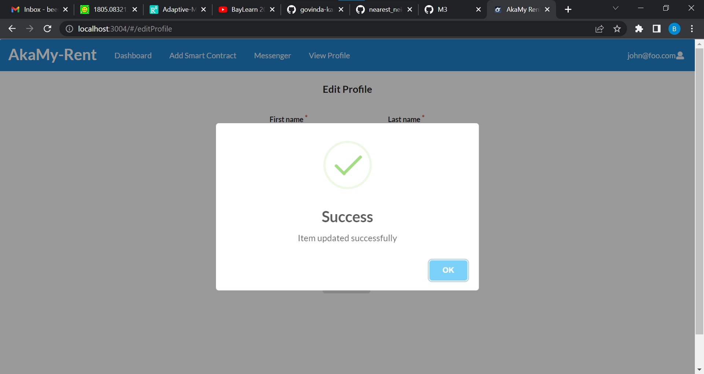

Whenever users are on different window and wanted to view their profile, they can go to the top right corner and click on the dropdown menu to select view profile.

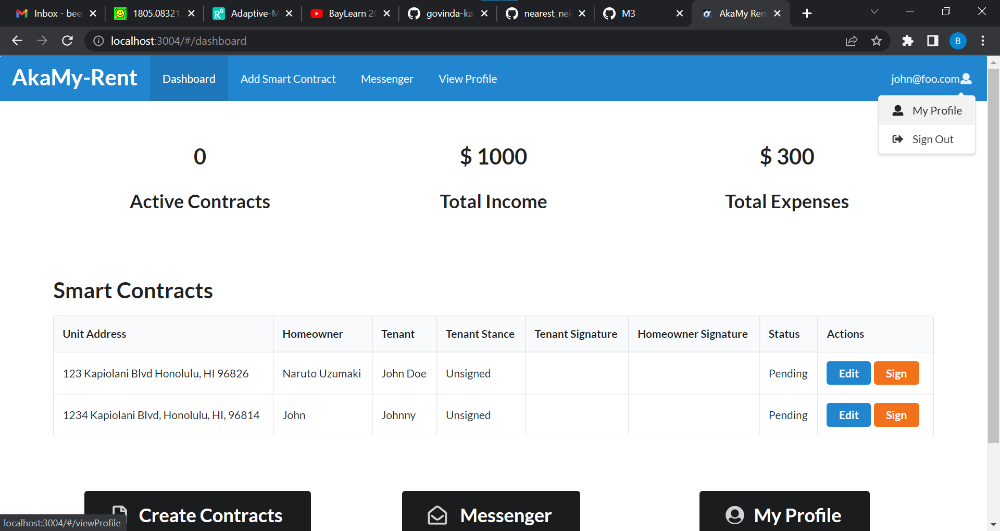

This will then directly take them to the view profile page. Users also have the option to navigate to different windows including the edit profile page.

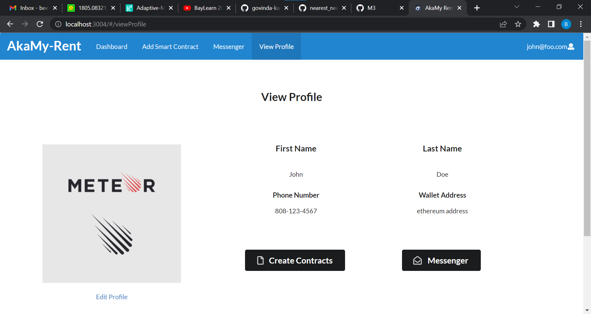


#### Dashboard

After signing in, the user can view their dashboard by clicking the button in the navigation bar. The dashboard provides an overview of all current contracts and some KPKIs. At the top of the dashboard, the users can check their total active contracts, income and expenses. In the Smart Contracts filed, there is a table for users to view all of their contracts, which contain the information of house address, homeowner name, tenant name and so on. The user can choose to sign or edit for each contract. In the sign link, users can view and deploy the smart contract by choosing agreement, and only tenant of this contract can sign the form. In the edit link, users can edit the smart contract if they want to change the content of it, and only homeowner of this contract can edit the form. Last but not least, there are three buttons: create contracts, messenger and my profile which will redirect users to the exact pages.

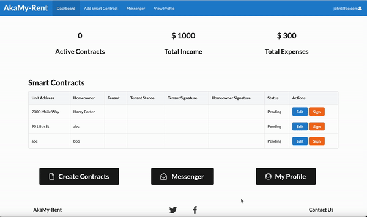

#### Smart Contracts
Any user can create a smart contract and those who do so will be assumed to be the homeowner. To do so, click on the 'Create Smart Contract' tab in the navbar.

The user will be taken to the 'Create Smart Contract page', which contains a form and fields for the user to complete. It is important that the homeowner email is the user's account email, otherwise they will be unable to edit the smart contract later on. When all fields are completed, pressing the 'save' button will save the data and create a new smart contract draft. The tenant will be able to view this smart contract from their account dashboard if their user correct account email is inputted into the 'Tenant email' field.

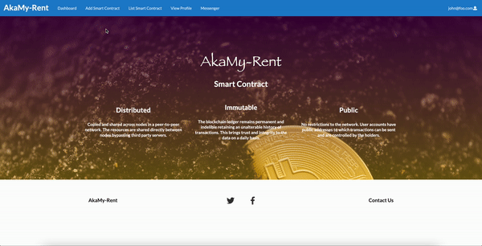

By clicking the 'Sign' button on the dashboard for the respective smart contract draft, the tenant can view the smart contract draft and declare their stance on the proposed smart contract by selecting 'Agreement' or 'Unsigned'. After selecting their stance and pressing save, the homeowner will be able to see the tenant stance. If the tenant agrees, they can go on to fill out the signature field. Once taking a signature, this field disappears. If the tenant disagrees with the proposed smart contract, they can reach out to the homeowner about their concerns through the 'Messenger' feature. Only the tenant can fill out these fields.

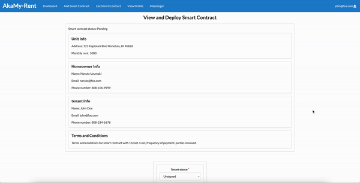

To modify the smart contract draft, the homeowner can select the 'Edit' page and make the necessary revisions. When completed, the homeowner can save their new updates for the tenant to view again.

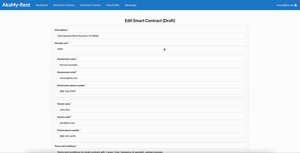

#### Messenger
The messenger component allows users on the same contract to communicate with one another.


<h2 id='dev-guide'>Developer Guide</h2>

<h3 id='meteor-dev-guide'>Meteor Guide</h3>

First, [install Meteor](https://www.meteor.com/install).

Second, request access from the author and clone the [akamy-repo](https://github.com/akamy-rent/akamy-rent).

Third, install libraries from within the `/app` directory

```
$ meteor npm install
```

And start the app

```
$ meteor npm run start
```

Should there be no problem, the app will run on localhost with port 3004 (http://localhost:3004), or whichever port you specify in the [package.json start script command](https://github.com/akamy-rent/akamy-rent/blob/c506b1976d906f0c54c8aa907a37aa876906755f/app/package.json#L42).


<h3 id='blockchain-dev-guide'>Smart Contract Development</h3>

This portion explains how to AkaMy interacts with the Python compilation server and the Ganache simulated blockchain. 

#### Initialize app
Start the app as normal `meteor npm run start`
#### Initialize insecure version of Chrome
## Warning: Only use the insecure version of Chrome to run the app, using it with other websites may lead to security breaches.
As of M2 we currently do not have a workaround for the bug below other than opening an insecure Chrome instance:
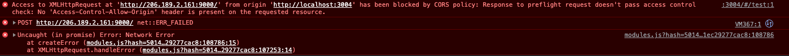

In AkaMy-Rents's current state you must initialize an insecure version of Chrome:
`open -n -a /Applications/Google\ Chrome.app/Contents/MacOS/Google\ Chrome --args --user-data-dir="/tmp/chrome_dev_test" --disable-web-security`.

#### Stage 1 complete: Application started
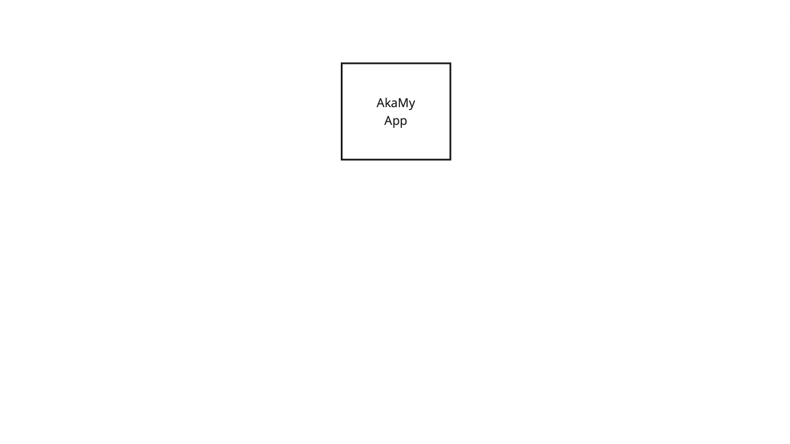

#### Initialize the Python Server
- In another terminal window run : `ssh root@206.189.2.161` .
- Use the password is `pythonS3rver`.
- Run the python server script `python3 /home/akamy-rent/py-compile-server/test_server.py`.
- You should then see `Server started http://206.189.2.161:9000` signaling that your server is ready to receive input.

#### Example of the server running

```
Hokus-MacBook-Pro:app hoku$ ssh root@206.189.2.161
root@206.189.2.161's password: 
Welcome to Ubuntu 20.04.4 LTS (GNU/Linux 5.4.0-97-generic x86_64)

 * Documentation:  https://help.ubuntu.com
 * Management:     https://landscape.canonical.com
 * Support:        https://ubuntu.com/advantage

  System information as of Tue Apr 26 00:51:38 UTC 2022

  System load:  1.04               Users logged in:       0
  Usage of /:   12.2% of 24.06GB   IPv4 address for eth0: 206.189.2.161
  Memory usage: 27%                IPv4 address for eth0: 10.18.0.7
  Swap usage:   0%                 IPv4 address for eth1: 10.110.0.4
  Processes:    109

0 updates can be applied immediately.


*** System restart required ***
Last login: Tue Apr 26 00:42:41 2022 from 76.173.228.38
root@python-server:~# python3 /home/akamy-rent/py-compile-server/test_server.py 
Server started http://206.189.2.161:9000
```

#### Stage 2 complete: Compile server started
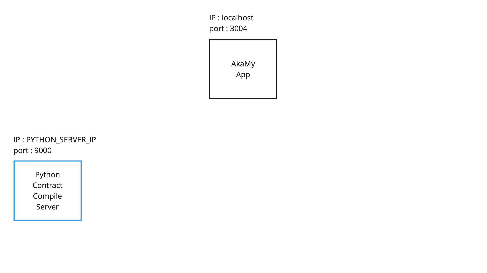

#### Initialize Ganache and gather account information for testing
- Open up Ganache and select the `Quickstart` option

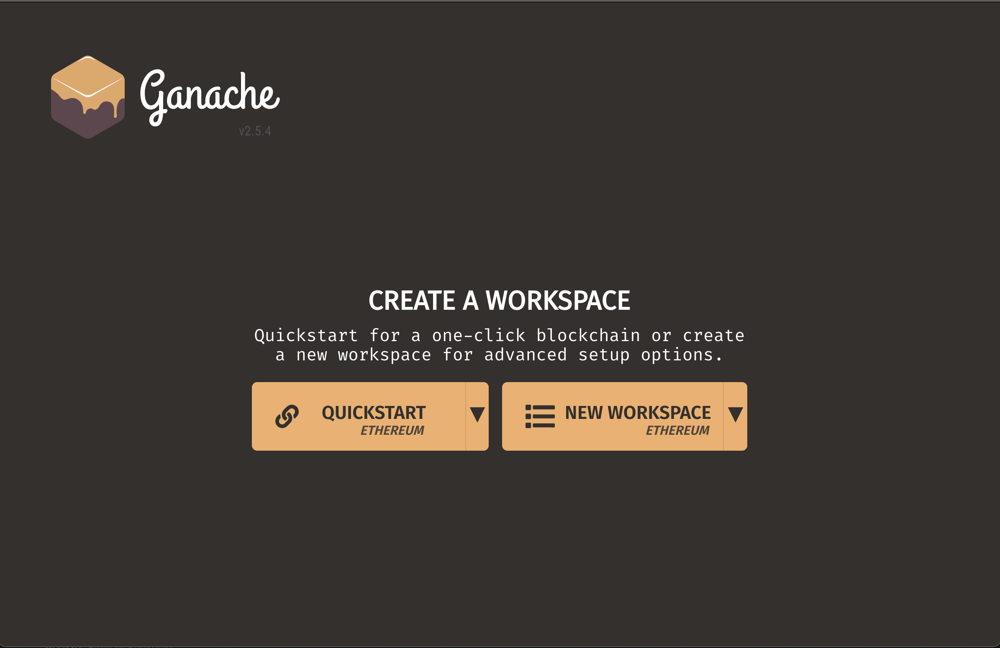

- There will be a menu filled with 10 accounts that are usable. Near the top there's a series of labels, make sure `RPC SERVER` is set to `HTTP://127.0.0.1:8545`.
  - If it's not set to that select the `gear icon near the top right corner` to change it.
  - Select `Server` in the navigation bar and make from there you can set it to the appropriate IP and port.

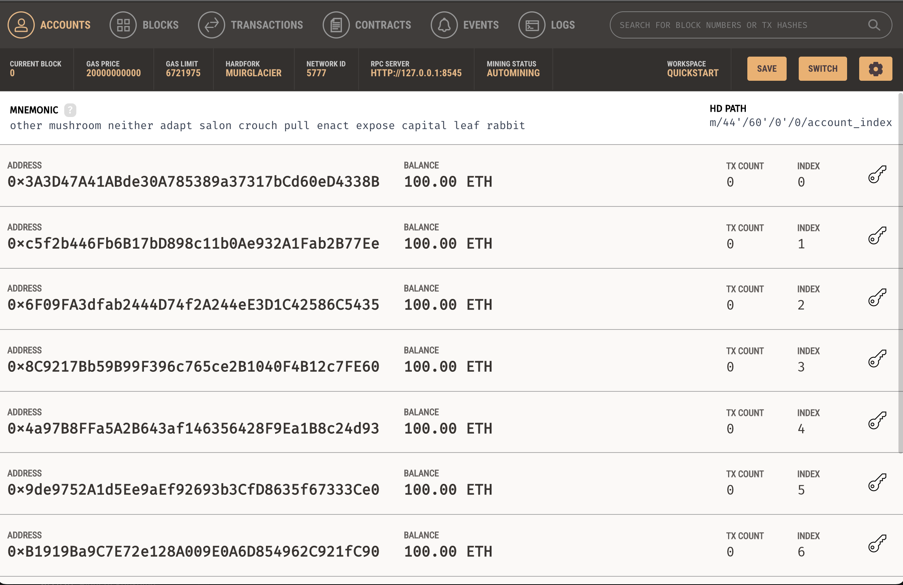

- Once your Ganache server IP and port have been set. Click the key icon to manually copy and paste `ACCOUNT ADDRESS` and `PRIVATE KEY` to wherever key data is stored.
  - In M2 the testing page utilizes a contract object to a single homeowner and a single tenant. This object can be found in `/app/imports/api/solc/connect2compiler.js`.
  - M3 should be communicating directly with the users and smart contract collections.

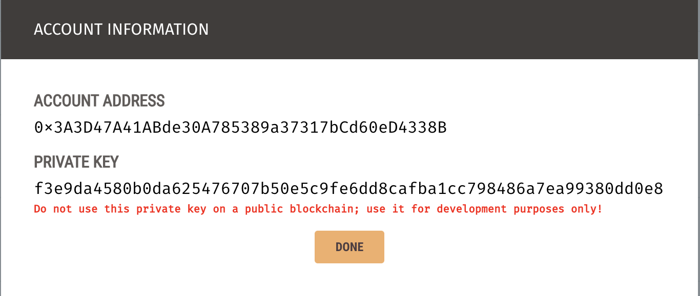

#### Stage 3: Key information copied to application
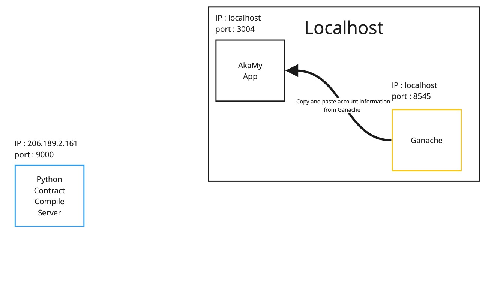

#### Navigating to the test contract page
Now that all systems are set up, accounts are initialized the test server. Use the 4 buttons to test the smart contract.

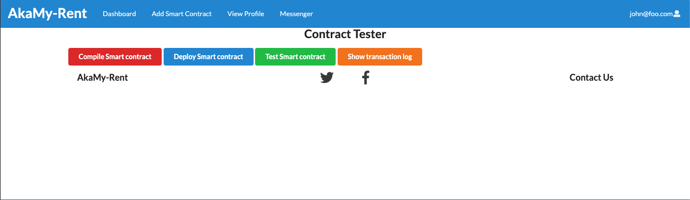

Use the buttons from left to right.
- Compile smart contract.
- Deploy it to Ganache.
- Use the smart contract timer function.
- Check transaction logs.
  - Currently can only view it in console, will implement later on.

#### Stage 4 completed: Test page can be used
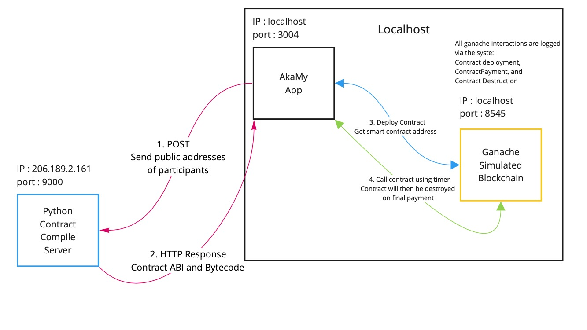
