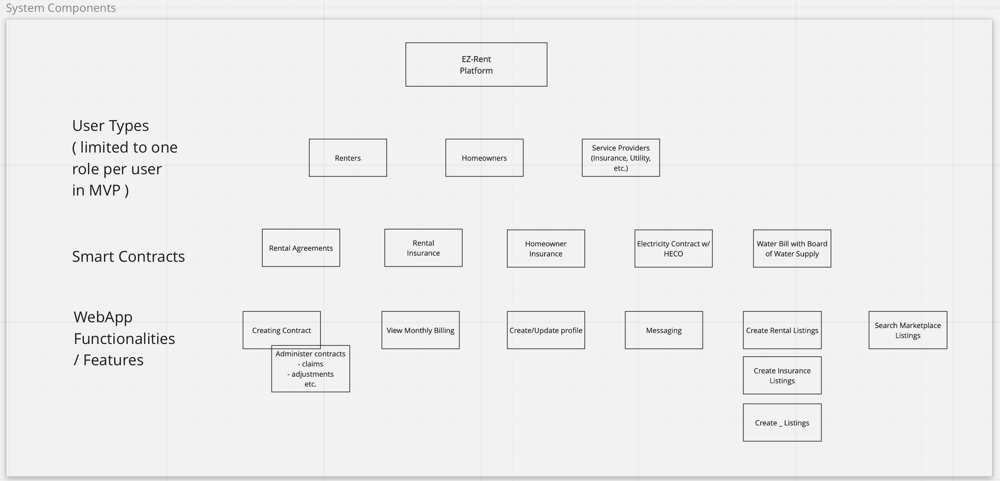
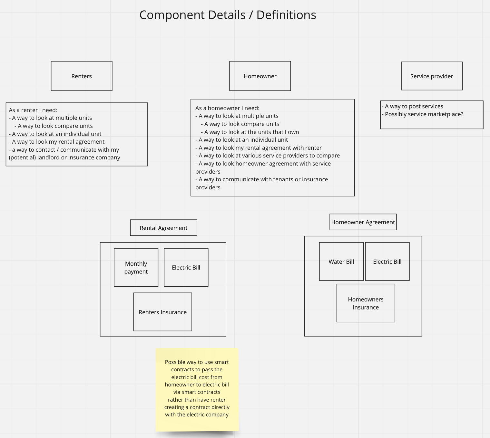
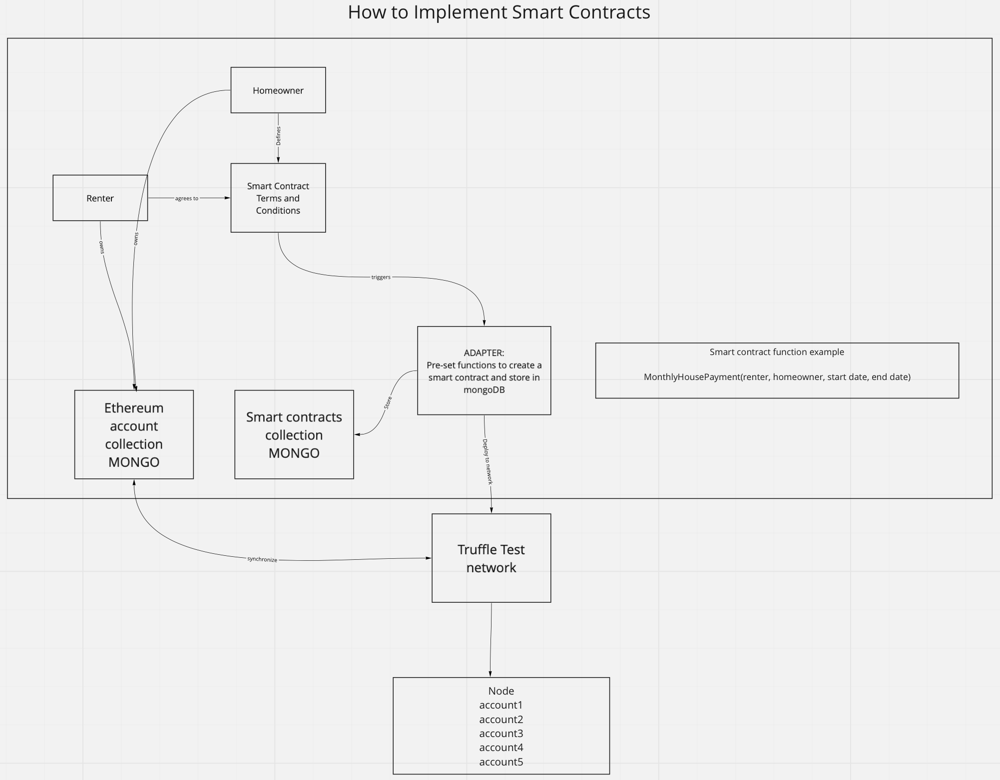

## EZ Rent

### Project Team

| Name              | Role              |
|-------------------|-------------------|
| Beemnet Alemayehu | Software Engineer |
| Devin Eng         | Software Engineer |
| Hoku Tobin        | Product Owner     |
| Holm Smidt        | Software Engineer |
| Yang Qian         | Software Engineer |

### The Problem

Renters and homeowners entering a contractual agreement will sometimes be overly cautious about entering the deal. Not only that but people who get into disputes need an immutable record to rely upon. This is especially true when it comes to students attempting to find housing.
The Solution

### The Solution
Solution is to utilize smart contracts to create a renter/rentee framework that would allow participants to enter an agreement with less uncertainty that they’re not going to get screwed over. This will also provide a single market place where landlords can post their properties and students can browse them.

### System Components and Features

#### Mockup Pages

- Landing Page
  - Current Market
  - Sign-up/sign-in prompt
- User home page
  - Option to create smart contract
  - Brief overview of current smart contracts
    - Who is involved with the contract, how much each monthly payments is, etc… 
  - Renter
  - Both
    - View smart contract information: Accounts for transferring currency, smart contract expiration date.
- Admin home page
  - User Profiles:
    - Account balances: to make sure no one is going to be ripped off.

#### Use Cases

- Smart Contracts
  - Track payment/deposits/fees
  - Track maintenance notes
- Landlords login into update properties/profile
- Landlord smart contract creation
- Renters are able to add renters insurance?
- Students login to browse properties listed and description of those properties.

#### Smart Contract Implementation

### Beyond the Basics

This would be done using smart contracts which are immutable programs that are set on the network. Smart contracts can be used to create an agreement between the renter and landlord. This means that the timing of payments will happen in perpetuity until the smart contract exists or is removed. The only way to change the smart contract is by creating a new one.
