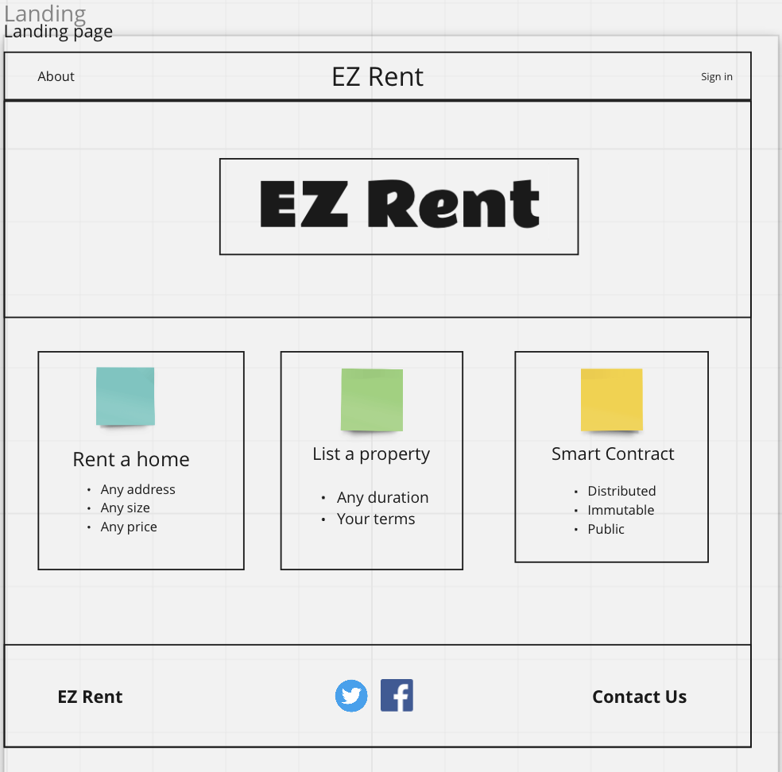
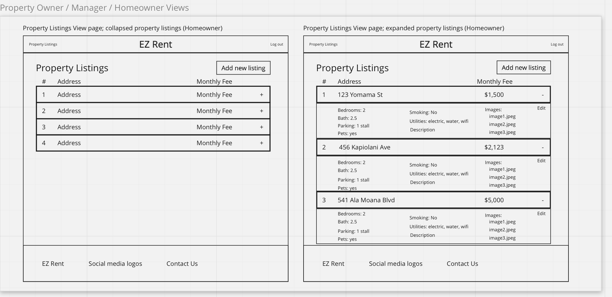
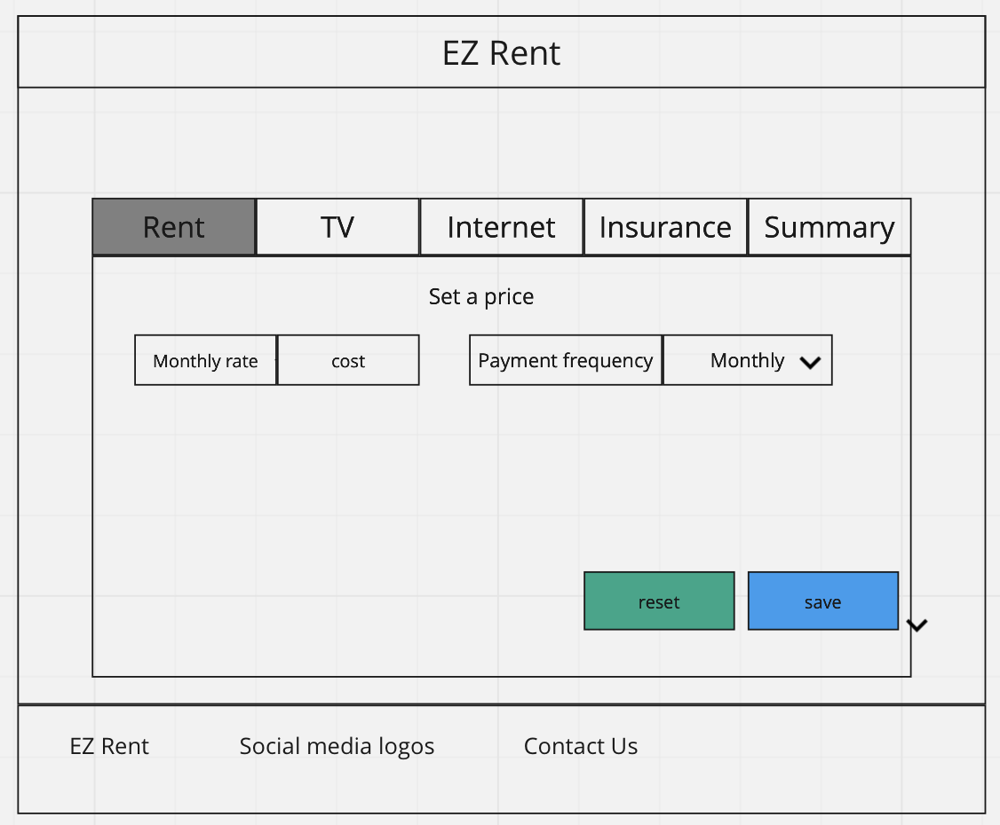
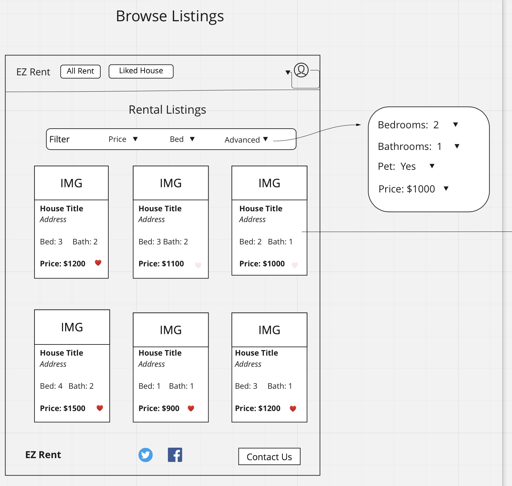
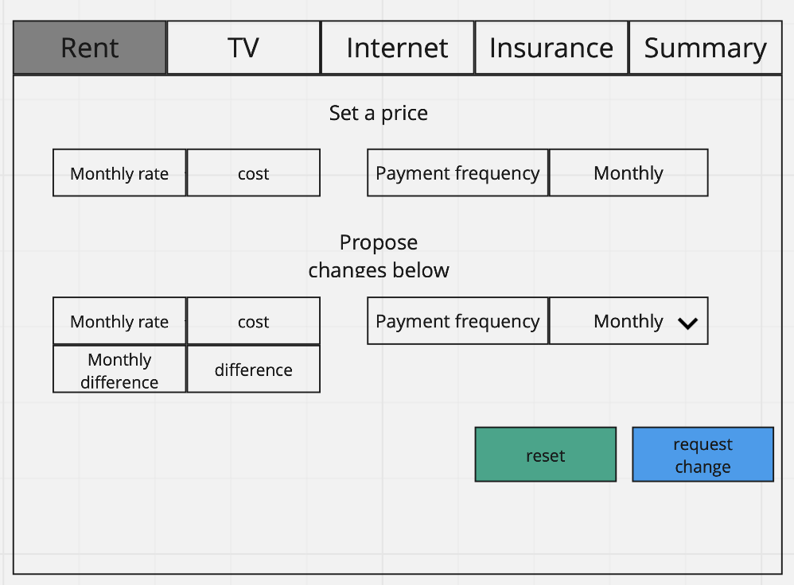
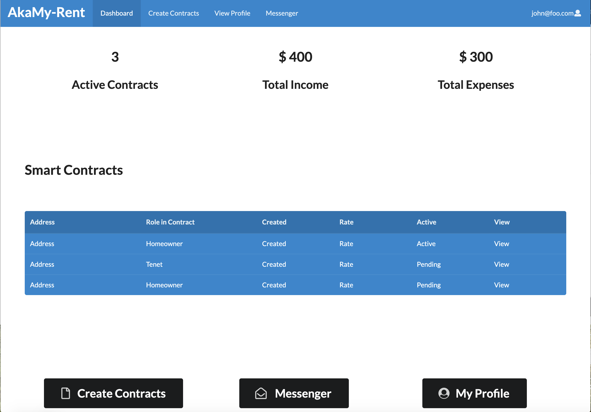
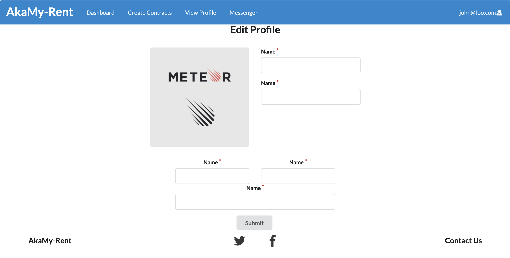
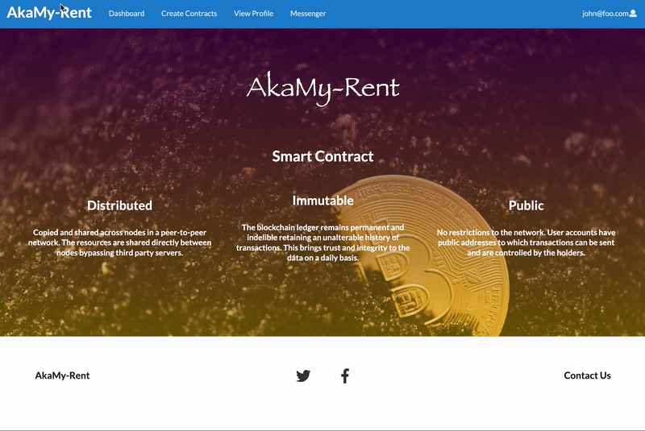
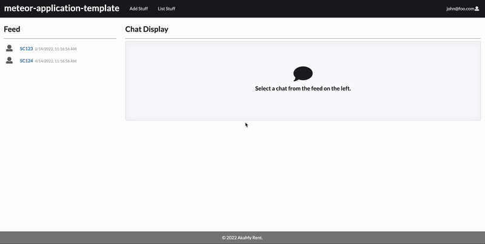

## AkaMy-Rent project pages
- [AkaMy-Rent organization page repository](https://github.com/akamy-rent/akamy-rent.github.io)
- [AkaMy-Rent project repository](https://github.com/akamy-rent/akamy-rent 

### Table of Contents
- [Creating app concepts](#Initial-Brainstorm)
- [Milestone 1](#Milestone-1)
- [Milestone 2](#Milestone-2)

### Project Team

| Image                                                                                                                      | Name              | Role              |
|----------------------------------------------------------------------------------------------------------------------------|-------------------|-------------------|
|  | Beemnet Alemayehu | Software Engineer  |
|   | Devin Eng         | Software Engineer |
|   | Hoku Tobin        | Product Owner     |
|    | Holm Smidt        | Software Engineer |
|                            | Yang Qian         | Software Engineer |

### Team contract
[Contract Link](https://docs.google.com/document/d/1h5UtweWjmoHZck7WArDCLBgyvddvCbIGD888rXcvB6Y/edit?usp=sharing)

### The Problem

Finding housing during University can be stressful for students. Homeowners are cautious when dealing with students as the rental agreements tend to be shorter, and having to consistently find a tenant can also be stressful.

### The Solution
AkaMy-Rent hopes to provide a framework that allows rental agreements to be: more accessible, easier to make, and provide a greater level of assurance for both homeowners and renters. Renters can benefit by having an assured rental cost that won't go up so long as their contract is valid. Homeowners can benefit by using the automated features of a smart contract and the Ethereum blockchain to ensure that rent comes in on time and can be fully paid.

# Initial Brainstorm

### System Components and Features

### Brainstorming Mockups

<h4>Homeowner examples</h4>

<h5>Landing page</h5>

<h5>Homeowner homepage</h5>

<h5>Homeowner Property Overview</h5>

<h5>Homeowner Contract editor</h5>

<h4>Renter examples</h4>

<h5>Potential listings</h5>

<h5>Negotiator component</h5>

### Use Cases

- Smart Contracts
  - Participants
  - payment period
  - payment frequency
  - contract time length
- Users login to view
  - smart contract status
  - smart contract summary
  - expenses from rentel per month
  - income from rentals per month
- Homeowner smart contract creation

### Application Component definition, used as a guide to create application creation

### Smart Contract Implementation

### Beyond the Basics

- Smart contracts are immutable programs that can be used by the Ethereum blockchain. They cannot be changed once they are deployed therefore it is a sound commitment by both parties. 
- Solidity: Language that smart contracts will be written in
  - Solc: Solidity compiler, used to compile smart contracts to return the ABI and Bytecode of a smart contract
    - ABI: Application Binary Interface
      - An array of function definitions to be used by our application
    - Bytecode:
      - Bytecode that is read by the Ethereum Virtual Machine, this project does not go further in depth of the EVM
- Ethersjs
  - Javascript library that's developed to use smart contracts. It's easy for beginners, and allows for simple contracts to be created and deployed
- Python compiler server
  - Meteor is unable to utilize Solc internally, so all smart contracts will be compiled by a python script on a server external to the app
- Ethereum network
  - Using the Ganache application by HardHat as a test network
    - Simulated the Ethereum blockchain
    - Keep track of transactions easily 
    - Has a GUI for ease of use
  - May possibly create an assortment of dummy accounts with metamask and utilize Ethereum test networks that are available. 

# Milestone 1
- [M1 project board](https://github.com/akamy-rent/akamy-rent/projects/1)
- [Deployment to digital Ocean](http://161.35.148.180)

### Meteor Mockups
#### Landing Page
The landing page of the app shows the main benefits of using smart contracts. 

#### Dashboard

After signing in, the user is redirected to their dashboard. The dashboard provides an overview of all current contracts and some KPIs.

#### Profile Page

Users can view and edit their profile using profile management pages. Shown below is the edit page.

#### Smart Contracts
The following sequence shows the form for creating smart contracts. 

#### Messenger
The messenger component allows users on the same contract to communicate with one another. 

# Milestone 2
- [M2 project board](https://github.com/akamy-rent/akamy-rent/projects/2)
