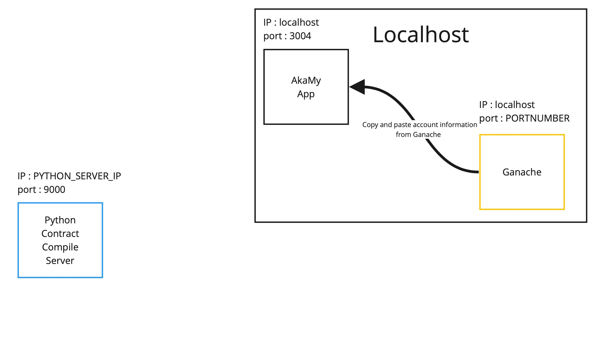
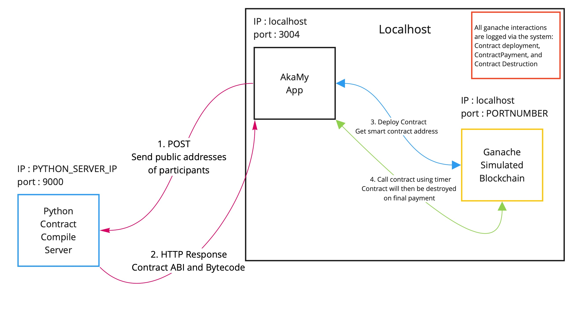

<style type="text/css">
   th, td { text-align: right; }
</style>


## AkaMy-Rent project pages
- [AkaMy-Rent organization page repository](https://github.com/akamy-rent/akamy-rent.github.io)
- [AkaMy-Rent project repository](https://github.com/akamy-rent/akamy-rent 


### Table of Contents
- [Creating app concepts](#Initial-Brainstorm)
- [Milestone 1](#M-1)
- [Milestone 2](#M-2)

### Project Team

| Image                                                                                                                      | Name              | Role              |
|----------------------------------------------------------------------------------------------------------------------------|-------------------|-------------------|
|  | Beemnet Alemayehu | Software Engineer  |
|   | Devin Eng         | Software Engineer |
|   | Hoku Tobin        | Product Owner     |
|    | Holm Smidt        | Software Engineer |
|                            | Yang Qian         | Software Engineer |

### Team contract
[Contract Link](https://docs.google.com/document/d/1h5UtweWjmoHZck7WArDCLBgyvddvCbIGD888rXcvB6Y/edit?usp=sharing)

### Overview

Finding housing during University can be stressful for students. Homeowners are cautious when dealing with students as the rental agreements tend to be shorter, and having to consistently find a tenant can also be stressful. AkaMy-Rent hopes to provide a framework that allows rental agreements to be: more accessible, easier to make, and provide a greater level of assurance for both homeowners and renters. Renters can benefit by having an assured rental cost that won't go up so long as their contract is secured on the blockchain. Homeowners can benefit by using the automated features of a smart contract and the Ethereum blockchain to ensure that rent comes in on time and can be fully paid.

<h1 id='Initial-Brainstorm'>Initial Brainstorm</h1>

### System Components and Features


### Brainstorming Mockups

<h4>Homeowner examples</h4>

<h5>Landing page</h5>


<h5>Homeowner homepage</h5>


<h5>Homeowner Property Overview</h5>


<h5>Homeowner Contract editor</h5>


<h4>Renter examples</h4>

<h5>Potential listings</h5>


<h5>Negotiator component</h5>


### Use Cases

- Smart Contracts
  - Participants
  - payment period
  - payment frequency
  - contract time length
- Users login to view
  - smart contract status
  - smart contract summary
  - expenses from rentel per month
  - income from rentals per month
- Homeowner smart contract creation

### Application Component definition, used as a guide to create application creation


### Smart Contract Implementation


### Beyond the Basics

- Smart contracts are immutable programs that can be used by the Ethereum blockchain. They cannot be changed once they are deployed therefore it is a sound commitment by both parties. 
- Solidity: Language that smart contracts will be written in
  - Solc: Solidity compiler, used to compile smart contracts to return the ABI and Bytecode of a smart contract
    - ABI: Application Binary Interface
      - An array of function definitions to be used by our application
    - Bytecode:
      - Bytecode that is read by the Ethereum Virtual Machine, this project does not go further in depth of the EVM
- Ethersjs
  - Javascript library that's developed to use smart contracts. It's easy for beginners, and allows for simple contracts to be created and deployed
- Python compiler server
  - Meteor is unable to utilize Solc internally, so all smart contracts will be compiled by a python script on a server external to the app
- Ethereum network
  - Using the Ganache application by HardHat as a test network
    - Simulated the Ethereum blockchain
    - Keep track of transactions easily 
    - Has a GUI for ease of use
  - May possibly create an assortment of dummy accounts with metamask and utilize Ethereum test networks that are available. 

<h1 id='M-1'>Milestone 1</h1>

- [M1 project board](https://github.com/akamy-rent/akamy-rent/projects/1)
- [Deployment to digital Ocean](http://161.35.148.180)

### Meteor Mockups
#### Landing Page
The landing page of the app shows the main benefits of using smart contracts. 


#### Dashboard

After signing in, the user is redirected to their dashboard. The dashboard provides an overview of all current contracts and some KPIs.


#### Profile Page

Users can view and edit their profile using profile management pages. Shown below is the edit page.


#### Smart Contracts
The following sequence shows the form for creating smart contracts. 


#### Messenger
The messenger component allows users on the same contract to communicate with one another. 


<h1 id='M-2'>Milestone 2</h1>

- [M2 project board](https://github.com/akamy-rent/akamy-rent/projects/2)

## User guide

## Developer Section
- [Smart contract testing](#smart-contract-development)

<h3 id='smart-contract-development'>Smart Contract Development</h3>

This portion explains how to AkaMy interacts with the Python compilation server and the Ganache simulated blockchain. 
#### Initialize app
Start the app as normal `meteor npm run start`
#### Initialize insecure version of Chrome
## Warning: Only use the insecure version of Chrome to run the app, using it with other websites may lead to security breaches.
As of M2 we currently do not have a workaround for the bug below other than opening an insecure Chrome instance:


In AkaMy-Rents's current state you must initialize an insecure version of Chrome:
`open -n -a /Applications/Google\ Chrome.app/Contents/MacOS/Google\ Chrome --args --user-data-dir="/tmp/chrome_dev_test" --disable-web-security`.

#### Stage 1 complete: Application started


#### Initialize the Python Server
- In another terminal window run : `ssh root@206.189.2.161` .
- Use the password is `pythonS3rver`.
- Run the python server script `python3 /home/akamy-rent/py-compile-server/test_server.py`.
- You should then see `Server started http://206.189.2.161:9000` signaling that your server is ready to receive input.

#### Example of the server running

```
Hokus-MacBook-Pro:app hoku$ ssh root@206.189.2.161
root@206.189.2.161's password: 
Welcome to Ubuntu 20.04.4 LTS (GNU/Linux 5.4.0-97-generic x86_64)

 * Documentation:  https://help.ubuntu.com
 * Management:     https://landscape.canonical.com
 * Support:        https://ubuntu.com/advantage

  System information as of Tue Apr 26 00:51:38 UTC 2022

  System load:  1.04               Users logged in:       0
  Usage of /:   12.2% of 24.06GB   IPv4 address for eth0: 206.189.2.161
  Memory usage: 27%                IPv4 address for eth0: 10.18.0.7
  Swap usage:   0%                 IPv4 address for eth1: 10.110.0.4
  Processes:    109

0 updates can be applied immediately.


*** System restart required ***
Last login: Tue Apr 26 00:42:41 2022 from 76.173.228.38
root@python-server:~# python3 /home/akamy-rent/py-compile-server/test_server.py 
Server started http://206.189.2.161:9000
```

#### Stage 2 complete: Compile server started


#### Initialize Ganache and gather account information for testing
- Open up Ganache and select the `Quickstart` option


- There will be a menu filled with 10 accounts that are usable. Near the top there's a series of labels, make sure `RPC SERVER` is set to `HTTP://127.0.0.1:8545`.
  - If it's not set to that select the `gear icon near the top right corner` to change it.
  - Select `Server` in the navigation bar and make from there you can set it to the appropriate IP and port.


- Once your Ganache server IP and port have been set. Click the key icon to manually copy and paste `ACCOUNT ADDRESS` and `PRIVATE KEY` to wherever key data is stored.
  - In M2 the testing page utilizes a contract object to a single homeowner and a single tenant. This object can be found in `/app/imports/api/solc/connect2compiler.js`.
  - M3 should be communicating directly with the users and smart contract collections.


#### Stage 3: Key information copied to application


#### Navigating to the test contract page
Now that all systems are set up, accounts are initialized the test server. Use the 4 buttons to test the smart contract.


Use the buttons from left to right.
- Compile smart contract.
- Deploy it to Ganache.
- Use the smart contract timer function.
- Check transaction logs.
  - Currently can only view it in console, will implement later on.

#### Stage 4 completed: Test page can be used

