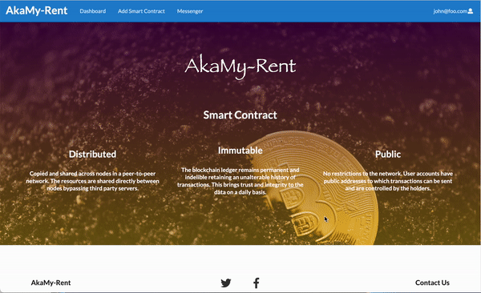
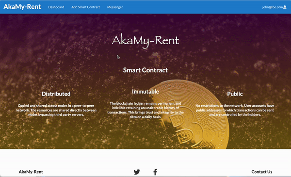
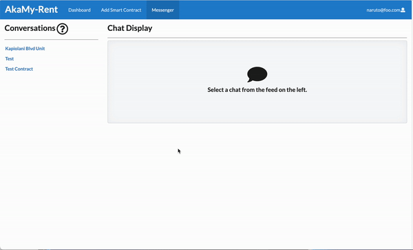
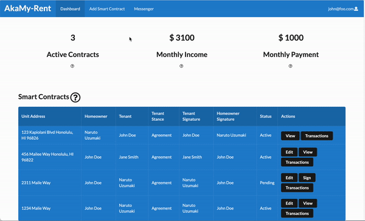

[Back to Home](./index.md)

<h1 id='M-3'>Milestone 3</h1>

This page describes our progress by Milestone 3. 

### Project links
- [M3 project board](https://github.com/akamy-rent/akamy-rent/projects/3)

### User Guide

#### Landing Page
The landing page of the app shows the main benefits of using smart contracts.

#### Profile Page

Once Users create a new account, they are directly prompted to the edit profile page filled with default placeholder values.

Then, they can make the necessary changes to the form fields and can confirm the changes have been submitted successfully by the following alert.

Whenever users are on different window and wanted to view their profile, they can go to the top right corner and click on the dropdown menu to select view profile.

This will then directly take them to the view profile page. Users also have the option to navigate to different windows including the edit profile page.

#### Dashboard

After signing in, the user can view their dashboard by clicking the button in the navigation bar. The dashboard provides an overview of all current contracts and some KPIs. At the top of the dashboard, the users can check their total active contracts, income and expenses. In the Smart Contracts field, there is a table for users to view all of their contracts, which contains the information of house address, homeowner name, tenant name and so on. The user can choose to sign or edit for each contract. In the sign link, users can view and deploy the smart contract by choosing agreement, and only tenant of this contract can sign the form. In the edit link, users can edit the smart contract if they want to change the content of it, and only homeowner of this contract can edit the form. Last but not least, there are three buttons: create contracts, messenger and my profile which will redirect users to the exact pages.

Last but not least, there are three buttons: create contracts, messenger and my profile which will redirect users to the exact pages.

#### Smart Contracts
Any user can create a smart contract and those who do so will be assumed to be the homeowner. To do so, click on the 'Create Smart Contract' tab in the navbar.

The user will be taken to the 'Create Smart Contract page', which contains a form and fields for the user to complete. It is important that the homeowner email is the user's account email, otherwise they will be unable to edit the smart contract later on. When all fields are completed, pressing the 'save' button will save the data and create a new smart contract draft. The tenant will be able to view this smart contract from their account dashboard if their user correct account email is inputted into the 'Tenant email' field.

By clicking the 'Sign' button on the dashboard for the respective smart contract draft, the tenant can view the smart contract draft and declare their stance on the proposed smart contract by selecting 'Agreement' or 'Unsigned'. After selecting their stance and pressing save, the homeowner will be able to see the tenant stance. If the tenant agrees, they can go on to fill out the signature field. Once taking a signature, this field disappears. If the tenant disagrees with the proposed smart contract, they can reach out to the homeowner about their concerns through the 'Messenger' feature. Only the tenant can fill out these fields.

To modify the smart contract draft, the homeowner can select the 'Edit' page and make the necessary revisions. When completed, the homeowner can save their new updates for the tenant to view again.

#### Messenger
The messenger component allows users on the same contract to communicate with one another. Every time a contract gets created, a group is created with the members of the smart contract. The contract name is then used as the messenger group name. The screenshots in the gif below show the automatic screen updates during a conversation between two users.

